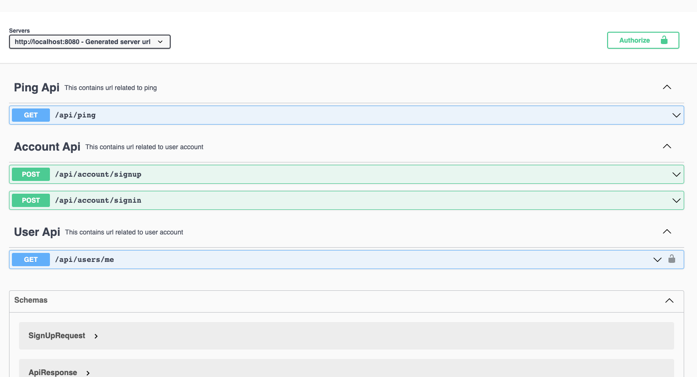
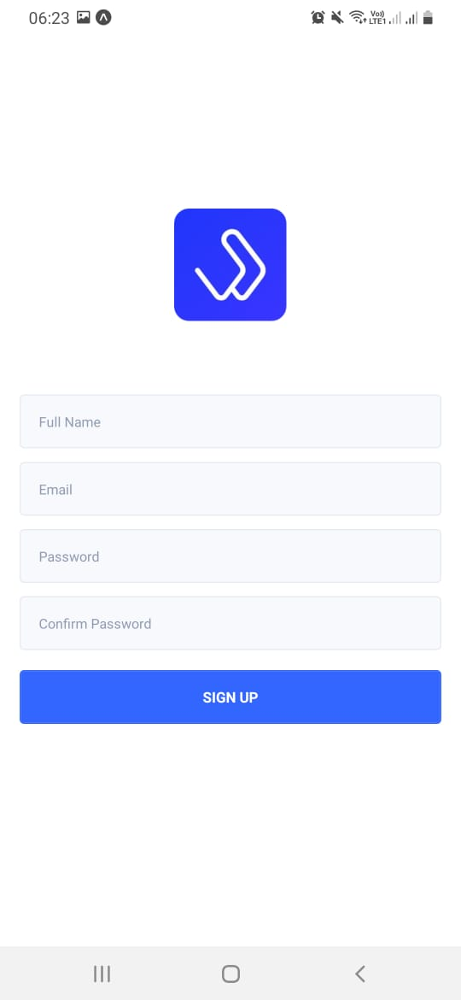

# Walletifai

This project on how to implement OAuth2 with JWT tokens using Spring Boot 2 and React-Native App. MongoDB is used as database for saving database.


## Technologies/Design Decisions

- Backend: Kotlin with Spring Boot
- Frontend: React-Native
- Database: MongoDB
- ORM: Spring Data
- Security: Spring Security
- Api Documentation: OpenAPI Swagger
- Solid Design Principals.

## Setting Development Environment

Clone or download repository. It's is recommended to use IntelliJ idea or other idle. Than open backend in idle to continue further.

### Setting up the Spring Server

```bash
docker-compose build
docker-compose up
```

Spring server start on http://localhost:8080 


### Setting up the React App (frontend)

```bash
cd app
npm i
npm start
```

## API Documentation



Link: http://localhost:8080/swagger-ui/index.html?url=/api/docs&validatorUrl=#/

## Screenshots

<div>
    
    
    
</div>

## Any questions

If you have any questions, feel free to ask me:

- **Mail**: <a href="mailto:deepanshut041@gmail.com">deepanshut041@gmail.com</a>  
- **Github**: [https://github.com/deepanshut041](https://github.com/deepanshut041)
- **Website**: [https://deepanshut041.github.io](https://deepanshut041.github.io)
- **Twitter**: <a href="https://twitter.com/deepanshut041">@deepanshut041</a>